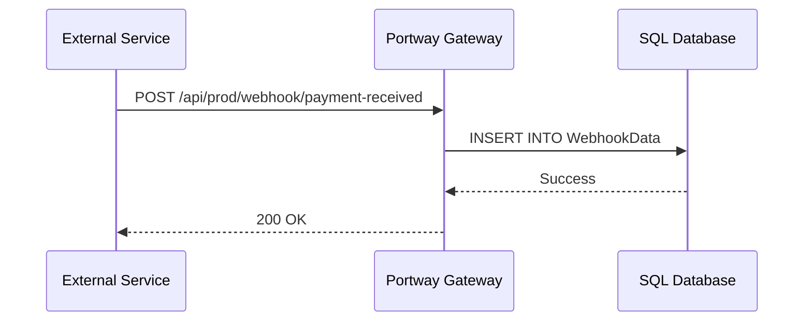

# Webhook Endpoints

> Receive HTTP POST payloads from external services and persist them to a SQL table.

Webhook endpoints accept incoming POST requests and store the JSON payload in a configured database table. The endpoint validates the webhook ID against an allowed list, inserts the payload with a timestamp, and returns a success response. No parsing or transformation occurs, the raw payload is stored as-is for downstream processing.



Downstream processing is handled by a separate job or procedure that reads from the webhook table. Portway does not retry failed inserts or forward payloads further.

## Database setup

Create the webhook table before configuring the endpoint:

```sql
CREATE TABLE [dbo].[WebhookData] (
    [Id]         INT IDENTITY(1,1) PRIMARY KEY,
    [WebhookId]  NVARCHAR(255)    NOT NULL,
    [Payload]    NVARCHAR(MAX)    NOT NULL,
    [ReceivedAt] DATETIME         NOT NULL DEFAULT GETDATE()
);

CREATE INDEX IX_WebhookData_WebhookId
ON [dbo].[WebhookData] ([WebhookId], [ReceivedAt] DESC);
```

If your processing job needs to track status, extend the table accordingly:

```sql
ALTER TABLE WebhookData ADD
    ProcessedAt DATETIME     NULL,
    RetryCount  INT          NOT NULL DEFAULT 0,
    LastError   NVARCHAR(MAX) NULL;
```

## Configuration

Create `endpoints/Webhooks/entity.json`:

```json
{
  "DatabaseObjectName": "WebhookData",
  "DatabaseSchema": "dbo",
  "AllowedColumns": [
    "payment_webhook",
    "shipping_webhook",
    "inventory_webhook"
  ]
}
```

### Configuration properties

| Property | Required | Type | Description |
|---|---|---|---|
| `DatabaseObjectName` | Yes | string | Table name for storing webhook payloads |
| `DatabaseSchema` | No | string | Database schema. Defaults to `dbo` |
| `AllowedColumns` | No | array | Webhook IDs this endpoint accepts. Any ID not listed is rejected with 400 |

Webhook IDs map to values in the `WebhookId` column. Use names that identify the source and event type, `stripe_payment_success`, `shopify_order_created`, rather than generic identifiers.

## Sending webhooks

```
POST /api/{environment}/webhook/{webhookId}
```

```http
POST /api/prod/webhook/payment-received
Content-Type: application/json
Authorization: Bearer <token>

{
  "event": "payment.success",
  "payment_id": "pay_123456",
  "amount": 99.99,
  "currency": "EUR",
  "timestamp": "2024-03-15T10:30:00Z"
}
```

**Response:**

```json
{
  "success": true,
  "message": "Webhook processed successfully",
  "result": null,
  "id": 12345
}
```

:::warning
All webhook endpoints require Bearer token authentication. External services that do not support custom request headers cannot authenticate directly with Portway. For services that require unauthenticated inbound webhooks, place a proxy or ingress layer in front that adds the token before forwarding to Portway.
:::

## Querying stored payloads

Use SQL Server's JSON functions to extract fields from stored payloads:

```sql
-- Recent payloads for one webhook type
SELECT TOP 10
    Id,
    JSON_VALUE(Payload, '$.event')      AS EventType,
    JSON_VALUE(Payload, '$.payment_id') AS PaymentId,
    ReceivedAt
FROM WebhookData
WHERE WebhookId = 'payment_webhook'
ORDER BY ReceivedAt DESC;
```

## Limitations

- POST only, webhook endpoints do not respond to GET, PUT, or DELETE
- JSON only, payloads must be valid JSON; non-JSON bodies are rejected
- No payload validation beyond JSON syntax and webhook ID matching
- No automatic retry on insert failure
- Default payload size limit: 10MB

## Troubleshooting

**"Webhook ID not configured"**: The ID in the URL must match an entry in `AllowedColumns` exactly. Webhook IDs are case-sensitive.

**Database connection errors**: Verify the table exists with the correct schema and that the environment's connection string account has INSERT permission on the table.

**Authentication failures**: Confirm the Bearer token is valid and has access to the target environment.

To increase log verbosity:

```json
{
  "Logging": {
    "LogLevel": {
      "PortwayApi.Api.EndpointController": "Debug"
    }
  }
}
```

Test with a minimal payload:

```bash
curl -X POST https://your-api/api/prod/webhook/test_webhook \
  -H "Authorization: Bearer <token>" \
  -H "Content-Type: application/json" \
  -d '{"test": "data"}'
```

## Next steps

- [SQL Endpoints](./endpoints-sql): query and expose webhook data
- [Security](./security)
- [Monitoring](./monitoring)
