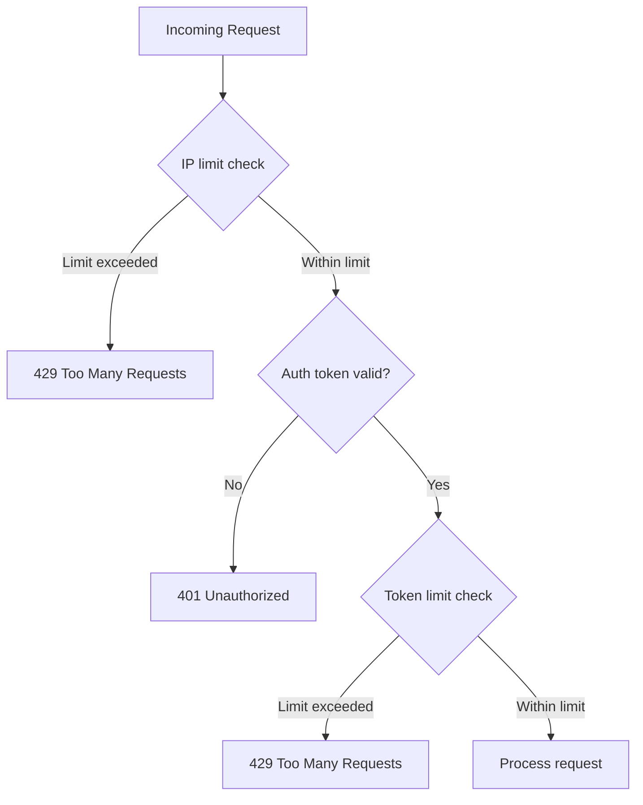

# Rate Limiting

> Control request volume per IP address and per authentication token.

Rate limiting is enabled by default. Portway applies two independent limits in sequence: an IP-based check on all traffic, then a token-based check on authenticated requests. Both use a sliding window token bucket algorithm, each client gets a bucket that refills at a constant rate and depletes by one per request.



## Configuration

```json
{
  "RateLimiting": {
    "Enabled": true,
    "IpLimit": 100,
    "IpWindow": 60,
    "TokenLimit": 1000,
    "TokenWindow": 60
  }
}
```

| Field | Description | Default |
|---|---|---|
| `Enabled` | Enable or disable rate limiting globally | `true` |
| `IpLimit` | Maximum requests per IP per window | `100` |
| `IpWindow` | Window duration in seconds for IP limits | `60` |
| `TokenLimit` | Maximum requests per token per window | `1000` |
| `TokenWindow` | Window duration in seconds for token limits | `60` |

Rate limits are tracked in memory. In a load-balanced deployment with multiple Portway instances, limits are enforced per instance, not across the cluster.

## Rate limit response

When a limit is exceeded, Portway returns:

```http
HTTP/1.1 429 Too Many Requests
Retry-After: 45

{
  "error": "Too many requests",
  "retryAfter": "2024-03-07T12:34:56Z",
  "success": false
}
```

The `Retry-After` header contains the number of seconds before the bucket has capacity again.

## Tuning for burst traffic

A shorter window with a higher limit accommodates traffic that arrives in bursts rather than at a steady rate:

```json
{
  "RateLimiting": {
    "IpLimit": 200,
    "IpWindow": 30,
    "TokenLimit": 2000,
    "TokenWindow": 30
  }
}
```

## Client retry logic

Clients should check for `429` responses and respect the `Retry-After` header before retrying:

```javascript
async function request(url, options) {
  const response = await fetch(url, options);

  if (response.status === 429) {
    const retryAfter = parseInt(response.headers.get('Retry-After') || '60');
    await new Promise(resolve => setTimeout(resolve, retryAfter * 1000));
    return request(url, options);
  }

  return response;
}
```

For production clients, combine this with exponential backoff, jitter, and a maximum retry count to avoid thundering-herd behaviour after a rate limit event.

## Troubleshooting

**Legitimate users receiving 429**: Review whether the `IpLimit` is too low for expected traffic. Per-token limits are typically set higher than per-IP limits; if a service account is being rate-limited, increase `TokenLimit`.

**Rate limiting not applying**: Confirm `"Enabled": true` in configuration and that the application has restarted after the change.

**Limits resetting unexpectedly**: Rate state is in-memory. Any application restart resets all buckets. This is expected behaviour.

Rate limit events are logged at Information level:

```
Rate limit reached for token_abc123: 0.25/100 tokens available, 1 required
IP 192.168.1.100 has exceeded rate limit, blocking for 60s
```

To increase verbosity:

```json
{
  "Serilog": {
    "MinimumLevel": {
      "Override": {
        "PortwayApi.Middleware.RateLimiter": "Debug"
      }
    }
  }
}
```

## Next steps

- [Security](./security)
- [Monitoring](./monitoring)
